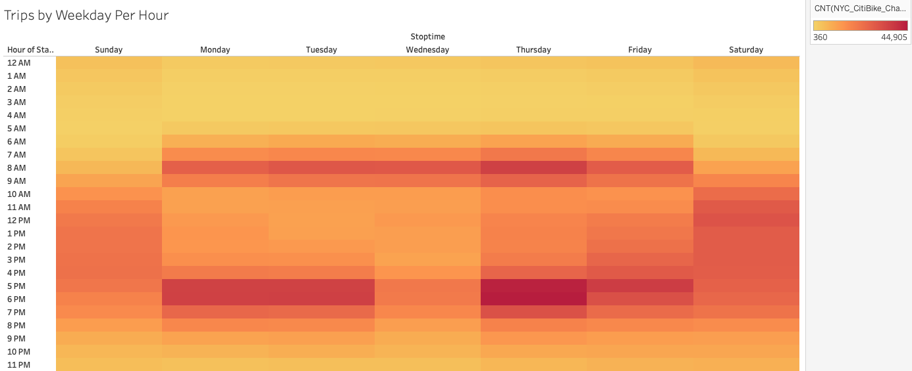
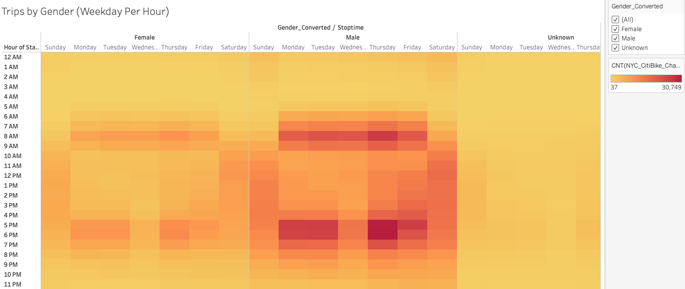
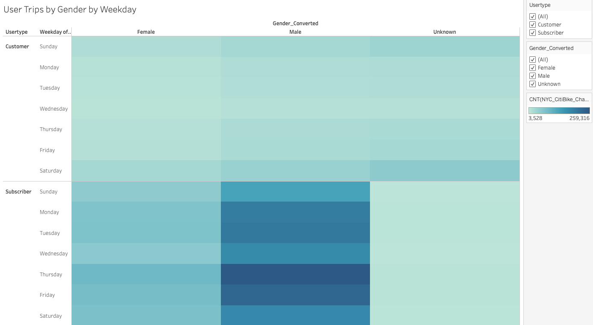

# Des Moines Bike-Sharing Proposal

## Overview

The purpose of this analysis is to analyze if there is a business opportunity for bikeshare space in Des Moines, Iowa. We have conducted the analysis with existing data of Citibike data from New York City for the month of August 2019. We have performed customer analysis including the length of rides throughout the day by various riders and the number of bike trips by day of the week for various riders. 

## Results

Interactive versions of all of the following graphics can be found at [this link](https://public.tableau.com/profile/pimchanya.chitsanga#!/vizhome/NYCCityBikeAnalysisChallenge/CheckoutTimeAnalysis).

### Customer Type Analysis

Citibike riders can be categorized by customers or subscribers, and by their gender. The breakdown of riders by customer type and by gender are shown below. The majority of Citibike riders are subscribers and the majority of Citibike riders are male.

### Trip Length

In the below image, we have analyzed bike-share usage. The number of bikes & trip duration increases up to about the 5th hour then from the 6th hour onward, the number of bikes used decreased steadily. When trip length is broken down by gender, female rider and male rider's curves formed similar shape. The curve in male riders is more steep, confirming our earlier findings that male is the majority of the riders. For unknown gender, the number of rides seem to be roughly the same for every trip length.

### Trips by Weekday 

The following heat map shows the most popular times for Citibike users broken down by day of the week and by hour. The most popular time to use a Citibike is weekdays during work commute times, approximately 6am-9am and 4pm-7pm. As for the weekend, anytime between 9am to 7pm are all popular. There is very little usage between 1am to 4am which would be an ideal time for repairs. 

When categorized by gender,CitiBike riding patterns between genders are relatively similar, however, we see more usage for male rather than female. 

When broken down by user type, one-time customers are more likely to be weekend riders than weekday commuters. Subscribers are the main uses of CitiBike and they are mainly weekday commuters. The usage patterns are consistent between malesand female riders. Users who did not report genders tend to be a weekend riders.

## Summary

Based on the analysis shown above, CitiBikes were used for trips around five hours trip length and for both weekdays and weekends which indicates signs of successful business. One useful future analysis would be to analyze cost of maintaining and the profit made on each ride in order for the investor to make decisions if the same business model would to work in Des Moines, which is vastly smaller than New York City. 

From the analysis above, usage patterns for male and female's bikers are roughly the same, however there are significantly more male bikers' usage than female. One analysis that CitiBike should further analyze is more user research to increase female rider incentives. Additionally, for the business to operate successfully in Des Moines, the data scientist should do further research on the bike route/ tourist attraction to attract both tourists and local populations.
